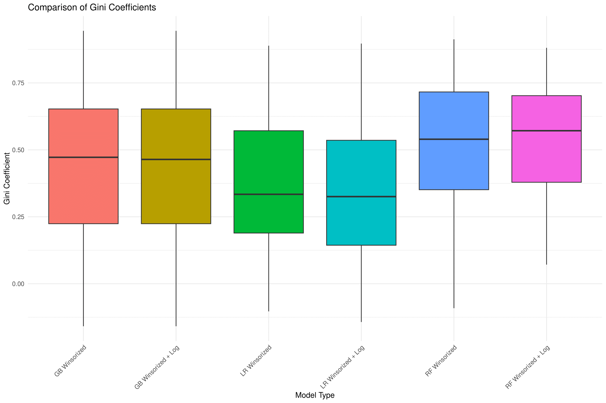

# Credit_risk_modelling
University project on evaluating default probabilities of Austrian companies
## Intro
- The project was prepared in collaboration with my colleagues Sebastian Rous and Sonja Katzensteiner. I was responsible for formulating the general approach to solve the problem and coding the following parts: Data Cleaning, Feature Engineering, Data Imputation and Data Transformations.
- Run 0_setup_parallel_processing.R to increase the speed of computation.
## General idea
- After data cleaning and feature engineering we tried different ways to transform data to get rid of outliers (winsorizing and combination of winsorizing and log transformation).
- For 2 transformed training datasets we carried out repeated stratified 10-fold cross validation to check the performance and the robustness of three models: logistic regression, gradient boosting and random forests.
- Based on the results of cross validation (see the chart below) we chose to train random forests on the whole dataset (winsorized + log-transformed), since the distribution of Gini coefficients has the lowest variance and the highest median Gini.

- Check [presentation](https://github.com/mike-kazakov/Credit_risk_modelling/blob/main/Presentation/Risk%20Management%20Rating%20Model.pdf) to delve deeper into the project
